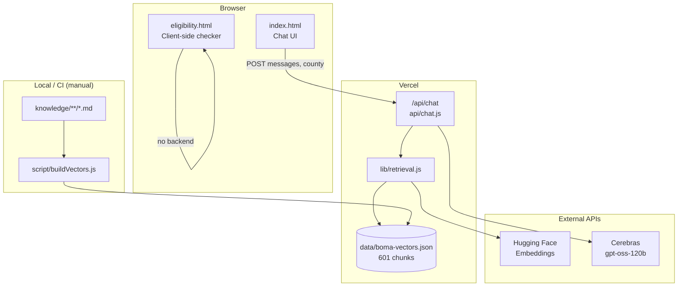

# Boma Yangu AI

**Kenya Housing Intelligence** — an AI-powered assistant that helps Kenyans understand the Affordable Housing Programme (AHP), National Housing Development Fund (NHDF), housing levy, eligibility, county projects, and application steps.

| | |
|---|---|
| **Production** | [https://boma-yangu-ai.vercel.app](https://boma-yangu-ai.vercel.app) |
| **Stack** | Static HTML + Vercel serverless + RAG (retrieval-augmented generation) |
| **LLM** | [Cerebras](https://cerebras.ai) `gpt-oss-120b` |
| **Embeddings** | Hugging Face `sentence-transformers/all-MiniLM-L6-v2` |

> **Disclaimer:** This is an independent educational tool. It is **not** the official Boma Yangu government portal. Always verify critical decisions at [bomayangu.go.ke](https://www.bomayangu.go.ke) or by calling **0700 832 832**.

---

## Table of contents

1. [What this project does](#what-this-project-does)
2. [Features](#features)
3. [Architecture (high level)](#architecture-high-level)
4. [Repository structure](#repository-structure)
5. [Quick start](#quick-start)
6. [Environment variables](#environment-variables)
7. [Documentation index](#documentation-index)
8. [Deployment](#deployment)
9. [Maintenance checklist](#maintenance-checklist)
10. [Official references](#official-references)

---

## What this project does

Boma Yangu AI combines three layers:

1. **Curated knowledge base** — 63 Markdown documents (~62 topical files + regional/cultural context) written for Kenyan housing questions, scams, tone, and county specifics.
2. **Vector retrieval (RAG)** — User questions are embedded and matched against 601 pre-built text chunks stored in `data/boma-vectors.json`.
3. **Conversational AI** — Retrieved context is injected into a detailed system prompt; [Cerebras](https://api.cerebras.ai) generates answers in English or Kiswahili with citations to official URLs.

A separate **Eligibility Checker** (`/eligibility`) runs entirely in the browser: income band, levy estimate, Nairobi project matching, and personalised next steps — no API call required.

---

## Features

| Feature | Location | Description |
|---------|----------|-------------|
| Bilingual chat | `index.html` | English / Kiswahili UI and AI replies matched to user language |
| County filter | `index.html` sidebar | Sends selected county to `/api/chat` for retrieval bias |
| RAG chat | `/api/chat` | Top-5 KB chunks + system prompt → Cerebras |
| Landing cards & chips | `index.html` | Quick prompts; Eligibility card navigates to `/eligibility` |
| Eligibility wizard | `eligibility.html` | 3-question form → band, projects, steps |
| Dark mode | Both pages | `data-theme` toggle |
| Scam warnings | KB + eligibility UI | Prominent “registration is FREE” messaging |

---

## Architecture (high level)



**Request path (chat):**

1. User sends message from `index.html` → `POST /api/chat` with `messages` and optional `county`.
2. `api/chat.js` takes the last user message, runs `retrieve(query, { topK: 5, county })`.
3. `lib/retrieval.js` embeds the query via Hugging Face (or falls back to keyword search).
4. Top chunks are formatted and appended to the system prompt with a source URL legend.
5. Cerebras returns the assistant reply as JSON `{ reply }`.

See [docs/ARCHITECTURE.md](docs/ARCHITECTURE.md) for deeper design notes.

---

## Repository structure

```
Boma Yangu Ai/
├── index.html              # Main chat application (single-page)
├── eligibility.html        # Eligibility checker (client-side only)
├── vercel.json             # URL rewrites (/eligibility → eligibility.html)
├── package.json            # Node deps (dotenv for build script)
│
├── api/
│   └── chat.js             # Vercel serverless: RAG + Cerebras
├── lib/
│   └── retrieval.js        # Vector + keyword retrieval
├── script/
│   └── buildVectors.js     # Offline: KB → embeddings → JSON
├── data/
│   └── boma-vectors.json   # Precomputed embeddings (deployed with app)
│
├── knowledge/              # Source of truth (Markdown)
│   ├── core/               # Programme facts, levy, lottery, FAQ, legal…
│   ├── Citizens/           # Employed, self-employed, diaspora, civil servants…
│   ├── Regions/            # County & regional project context
│   ├── Context/            # Tone, culture, Sheng, scams navigation (20 files)
│   ├── security/           # Scam patterns
│   └── Employers.md/       # Employer levy guide
│
└── docs/                   # Extended documentation (this repo)
    ├── ARCHITECTURE.md
    ├── KNOWLEDGE_BASE.md
    ├── API.md
    ├── FRONTEND.md
    ├── DEPLOYMENT.md
    └── DEVELOPMENT.md
```

---

## Quick start

### Prerequisites

- [Node.js](https://nodejs.org/) 18+ (for vector rebuild only)
- [Vercel CLI](https://vercel.com/docs/cli) (for deployment)
- API keys: **Cerebras**, **Hugging Face** (see below)

### Local preview (static pages)

Serve the project root with any static server. API routes need Vercel dev:

```bash
npm install
npx vercel dev
```

Open `http://localhost:3000` (default Vercel dev port). Chat requires `.env.local` with valid keys.

### Rebuild knowledge vectors (after KB edits)

```bash
# .env.local must contain HF_TOKEN=
node script/buildVectors.js
```

Then redeploy so `data/boma-vectors.json` is updated on production.

---

## Environment variables

| Variable | Required | Where | Purpose |
|----------|----------|-------|---------|
| `CEREBRAS_API_KEY` | Yes (runtime) | Vercel project env | Cerebras chat completions |
| `HF_TOKEN` | Yes (runtime + build) | Vercel + `.env.local` | Hugging Face embedding API |

**Local file:** `.env.local` (gitignored). Never commit API keys.

**Vercel:** Project → Settings → Environment Variables → add for Production, Preview, and Development.

---

## Documentation index

| Document | Contents |
|----------|----------|
| [docs/ARCHITECTURE.md](docs/ARCHITECTURE.md) | Components, data flow, RAG pipeline, failure modes |
| [docs/KNOWLEDGE_BASE.md](docs/KNOWLEDGE_BASE.md) | KB folders, authoring rules, vector build process |
| [docs/API.md](docs/API.md) | `/api/chat` request/response, errors, prompt design |
| [docs/FRONTEND.md](docs/FRONTEND.md) | `index.html` and `eligibility.html` behaviour |
| [docs/DEPLOYMENT.md](docs/DEPLOYMENT.md) | Vercel setup, rewrites, production deploy |
| [docs/DEVELOPMENT.md](docs/DEVELOPMENT.md) | Local dev, testing, contributing, release workflow |

---

## Deployment

Production is hosted on **Vercel** (project: `boma-yangu-ai`).

```bash
vercel --prod
```

Details: [docs/DEPLOYMENT.md](docs/DEPLOYMENT.md).

---

## Maintenance checklist

When updating housing facts or projects:

1. Edit relevant files under `knowledge/` (include `last_verified` / sources in front matter where used).
2. Run `node script/buildVectors.js` and commit `data/boma-vectors.json`.
3. Update hardcoded project data in `eligibility.html` if Nairobi listings change.
4. Deploy with `vercel --prod`.
5. Smoke-test: chat in EN/SW, county filter, `/eligibility` flow, and a known FAQ question.

---

## Official references

| Resource | URL |
|----------|-----|
| Boma Yangu portal | https://www.bomayangu.go.ke |
| Housing & Urban Development | https://www.housingandurban.go.ke |
| KRA (Housing Levy) | https://www.kra.go.ke |
| Affordable Housing Act 2024 | Government legal database / AHB publications |

---

## License & attribution

Knowledge base content is written for public education about Kenya’s Affordable Housing Programme. **Powered by Cerebras** (`gpt-oss-120b`) as shown in the UI. Third-party fonts: Google Fonts (Syne, Plus Jakarta Sans, DM Mono).

For questions about this codebase, start with [docs/DEVELOPMENT.md](docs/DEVELOPMENT.md).
