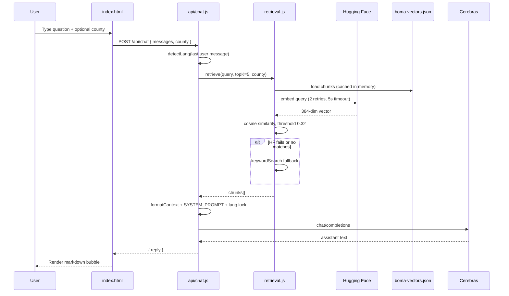

# Architecture

This document explains how Boma Yangu AI is designed, how data flows end to end, and where each component lives.

---

## Design goals

1. **Accuracy over fluency** — Answers must come from the knowledge base or explicit programme facts in the system prompt; hallucinated paybills, prices, or deadlines are forbidden.
2. **Low operational cost** — Static frontends, one serverless function, precomputed vectors (no database).
3. **Kenyan context** — 20 “Context” KB files shape tone, language, scams, and cultural realism.
4. **Resilience** — If Hugging Face embedding fails at query time, keyword fallback still returns chunks.

---

## Component overview

| Layer | Technology | Responsibility |
|-------|------------|----------------|
| Chat UI | `index.html` (vanilla JS) | UX, i18n strings, history, markdown rendering, calls API |
| Eligibility UI | `eligibility.html` (vanilla JS) | Rule-based eligibility; embedded Nairobi project dataset |
| API | `api/chat.js` (Vercel serverless) | Auth to Cerebras, orchestrate retrieval + prompt |
| Retrieval | `lib/retrieval.js` | Load vectors, embed query, cosine similarity, format context |
| Vector store | `data/boma-vectors.json` | 601 chunks × 384-dim embeddings |
| KB source | `knowledge/**/*.md` | Human-maintained content |
| Build | `script/buildVectors.js` | Offline embedding pipeline |

---

## End-to-end: chat request



---

## Retrieval engine (`lib/retrieval.js`)

### Vector store loading

- Path: `data/boma-vectors.json` (relative to `process.cwd()` on Vercel).
- Parsed once per warm lambda instance and held in module-level `_vectorStore`.
- Missing file throws: *"Run: node script/buildVectors.js"*.

### Query embedding

- Model: `sentence-transformers/all-MiniLM-L6-v2` via Hugging Face Inference API.
- Endpoint: `router.huggingface.co` feature-extraction pipeline.
- **Timeout:** 5 seconds per attempt, **2 retries**, 400 ms between retries (fits Vercel’s ~10s function budget with room for Cerebras).

### Scoring

- **Cosine similarity** between query embedding and each chunk embedding.
- **Threshold:** `0.32` — chunks below this are dropped.
- **Top K:** default `5` (overridden by `api/chat.js` via `TOP_K`).

### Keyword fallback

Triggered when:

- Hugging Face fails after retries, or
- Vector search returns zero chunks above threshold.

Scores chunks by counting query word occurrences (with English + Swahili stop words removed). Normalised score is returned with `method: "keyword"`.

### County / scope filtering

The `retrieve()` function accepts optional `scope` and `county` and filters chunks where `chunk.county` / `chunk.scope` match.

**Current limitation:** `script/buildVectors.js` only stores `text`, `source`, and `embedding`. County/scope are **not** written at build time, so filtering by county in production typically has no effect until the build script is extended to parse county from file paths or front matter.

The chat UI still sends `county` from the sidebar for future use and documentation accuracy.

### Context formatting

`formatContext(chunks)` produces labelled blocks:

```
--- Source 1: core/02-eligibility.md [NATIONAL] ---
<chunk text>
```

If no chunks: returns `NO_KB_MATCH: ...` instructing the model not to invent an answer.

---

## Chat API (`api/chat.js`)

### Constants

| Constant | Value | Role |
|----------|-------|------|
| `CEREBRAS_MODEL` | `gpt-oss-120b` | Generation model |
| `MAX_TOKENS` | `900` | Response length cap |
| `TEMPERATURE` | `0.3` | Low creativity for factual answers |
| `MAX_HISTORY` | `6` | Messages sent to API (trimmed from client’s slice) |
| `TOP_K` | `5` | Retrieval depth |

### System prompt structure

The prompt is a large static string (~200 lines) with sections:

1. Language rule (mirror user language)
2. Persona (warm Kenyan housing officer)
3. Programme background (AHP, NHDF, levy, eligibility bands, application steps)
4. How to answer (structure, length, next action)
5. Citation format (`> Source: [Name](URL)`)
6. Strict rules (no hallucination, no passwords, `NO_KB_MATCH` handling)

At runtime, appended:

- `KNOWLEDGE BASE CONTEXT` from retrieval
- `SOURCE URL LEGEND` mapping chunk filenames → official URLs (`SOURCE_URLS` map)
- Language lock line (EN or SW)

### Language detection

Heuristic: count Swahili cue words in the user message; if ≥ 2 hits → `sw`, else `en`. A final instruction block forces the model to reply in that language only.

### Error handling

| HTTP | Cause |
|------|-------|
| 400 | Missing/invalid `messages` |
| 405 | Non-POST |
| 429 | Cerebras rate limit |
| 500 | Missing `CEREBRAS_API_KEY` or empty model reply |
| 502 | Network/Cerebras failure |

CORS: `Access-Control-Allow-Origin: *` for POST from static origin.

---

## Eligibility checker (client-only)

No server involvement. Logic in `eligibility.html`:

- **Income bands** — `BANDS` array (social / low-cost / standard / market) aligned with AHP definitions.
- **Levy** — `1.5%` of gross monthly income; employer match row for employed users.
- **Nairobi projects** — `NAIROBI_PROJECTS` array with verified prices, status, TPS notes, and source comments in code.
- **Other counties** — `OTHER_COUNTY_MSG` directs users to the portal without inventing prices.

This path is intentionally **deterministic** so eligibility summaries stay stable and auditable.

---

## Security model

| Topic | Approach |
|-------|----------|
| API keys | Server-side env only; never in HTML |
| User PII | UI does not collect ID numbers for the API; eligibility form data stays in browser |
| CORS | Permissive (`*`) — suitable for static SPA; tighten if adding auth |
| Prompt injection | System prompt instructs KB-only facts; retrieval limits topical drift |
| Scams | KB + UI banners; model told never to ask for M-Pesa PINs |

---

## Scalability & limits

- **Vercel serverless:** Cold starts reload vector JSON (~large file); consider monitoring function memory/duration.
- **Hugging Face:** Rate limits may trigger keyword fallback more often under load.
- **Cerebras:** 429 returned to client with friendly message.
- **Client debounce:** 4 seconds between sends in `index.html` to reduce abuse.

---

## Extension points

1. Add `county` / `scope` to `buildVectors.js` from path (`Regions/Nairobi.md`) or YAML front matter.
2. Split `api/chat.js` system prompt into a versioned file or CMS.
3. Add streaming responses (SSE) for faster perceived latency.
4. Analytics endpoint (privacy-preserving) for top unanswered queries.
5. Connect eligibility checker to same KB via lightweight API for non-Nairobi pricing when available.
