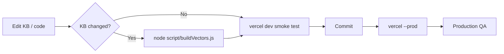

# Development guide

How to set up, change, test, and ship Boma Yangu AI.

---

## Prerequisites

| Tool | Version | Purpose |
|------|---------|---------|
| Node.js | 18+ | Vector build script |
| npm | 9+ | Dependencies |
| Vercel CLI | Latest | Local API + deploy |
| Git | Any | Version control |

Accounts:

- [Cerebras](https://cloud.cerebras.ai) — chat API key
- [Hugging Face](https://huggingface.co/settings/tokens) — embedding API

---

## Initial setup

```bash
git clone <repository-url>
cd "Boma Yangu Ai"
npm install
```

Create `.env.local`:

```env
CEREBRAS_API_KEY=your_cerebras_key
HF_TOKEN=your_huggingface_token
```

Link Vercel (optional, for `vercel dev`):

```bash
vercel link
```

---

## Local development

### Recommended: Vercel dev (API + static)

```bash
vercel dev
```

- Serves `index.html` at `/`
- Runs `/api/chat` with env from `.env.local`
- Default port often `3000`

### Static-only (no chat API)

Any static server works for UI work only:

```bash
npx serve .
# or
python -m http.server 8080
```

Chat will fail without `/api/chat` — use `vercel dev` for full stack.

---

## Project scripts

| Command | Description |
|---------|-------------|
| `npm install` | Install `dotenv` |
| `node script/buildVectors.js` | Regenerate `data/boma-vectors.json` from `knowledge/` |

There is no `npm test` or `npm run build` yet.

---

## Making common changes

### Update housing facts

1. Edit Markdown under `knowledge/`
2. `node script/buildVectors.js`
3. Test locally with `vercel dev`
4. Commit KB + `data/boma-vectors.json`
5. `vercel --prod`

See [KNOWLEDGE_BASE.md](KNOWLEDGE_BASE.md).

### Change AI behaviour

| Goal | File |
|------|------|
| Tone, rules, programme facts | `api/chat.js` → `SYSTEM_PROMPT` |
| Retrieval depth / threshold | `lib/retrieval.js` or `TOP_K` in `api/chat.js` |
| Citation URLs | `SOURCE_URLS` in `api/chat.js` |
| Model / tokens | Constants at top of `api/chat.js` |

Redeploy after API changes; no vector rebuild needed.

### Update eligibility projects

Edit `NAIROBI_PROJECTS` or `OTHER_COUNTY_MSG` in `eligibility.html`.  
No vector rebuild. Deploy static file only.

### Add a new page

1. Create `pagename.html`
2. Add rewrite in `vercel.json` if clean URL desired
3. Link from `index.html` or eligibility CTA

---

## Testing checklist

### Manual QA (before production)

**Chat (`index.html`)**

- [ ] Send message EN — coherent reply with source line
- [ ] Send message SW — reply fully in Swahili
- [ ] County filter Nairobi — housing answer mentions county if in KB
- [ ] Eligibility card → `/eligibility`
- [ ] Dark mode toggle
- [ ] New chat clears history and restores welcome
- [ ] Rapid double-send blocked (4s debounce)

**Eligibility (`eligibility.html`)**

- [ ] Income 35000, employed, Nairobi — band + projects shown
- [ ] Invalid/empty income — validation highlight
- [ ] Other county — portal message, no fake prices
- [ ] Reset form works
- [ ] Back to chat link

**API (curl)**

```bash
curl -X POST http://localhost:3000/api/chat \
  -H "Content-Type: application/json" \
  -d "{\"messages\":[{\"role\":\"user\",\"content\":\"What is the housing levy rate?\"}]}"
```

Expect `200` and `"reply"` string.

---

## Code conventions

- **Vanilla JS** in HTML — no transpiler; keep functions small and named clearly
- **ES modules** in `api/` and `lib/` (`import`/`export`)
- **CommonJS** in `script/buildVectors.js` (`require`) — intentional for Node script simplicity
- **CSS variables** for theming; avoid duplicating hex values
- **Bilingual strings** — always update `C.en` and `C.sw` together

---

## Git workflow (suggested)

```text
main          → production (vercel --prod)
feature/*     → preview deploys (vercel)
```

**Do not commit:**

- `.env.local`
- API keys in HTML or KB examples

**Do commit:**

- `data/boma-vectors.json` after intentional KB rebuilds

---

## Known limitations

1. **County retrieval filter** — UI sends county but vector chunks lack `county` metadata until build script is extended.
2. **No automated tests** — rely on manual QA checklist.
3. **Large vector file** — increases cold start; consider sharding or external store if chunk count grows 10×.
4. **package.json `type: module`** — build script uses CommonJS; do not rename without updating `buildVectors.js`.
5. **Client history** — not persisted; refresh clears chat.

---

## Contributing content vs code

### Content contributors

- Work in `knowledge/` with clear sources and dates
- Avoid political advocacy; stick to programme facts and user help
- Run vector build or ask maintainer to rebuild before release

### Code contributors

- Minimal diffs; match existing style
- Document new env vars in README and DEPLOYMENT
- Update `SOURCE_URLS` when adding KB files that need specific citations

---

## Release workflow (end to end)



1. Develop on branch
2. Rebuild vectors if needed
3. `vercel dev` smoke test
4. Commit with clear message (why, not just what)
5. `vercel --prod`
6. Run post-deploy checklist in [DEPLOYMENT.md](DEPLOYMENT.md)

---

## Getting help

| Topic | Document |
|-------|----------|
| System design | [ARCHITECTURE.md](ARCHITECTURE.md) |
| KB authoring | [KNOWLEDGE_BASE.md](KNOWLEDGE_BASE.md) |
| API contract | [API.md](API.md) |
| UI behaviour | [FRONTEND.md](FRONTEND.md) |
| Deploy issues | [DEPLOYMENT.md](DEPLOYMENT.md) |

Official housing support: **0700 832 832** · [bomayangu.go.ke](https://www.bomayangu.go.ke)
