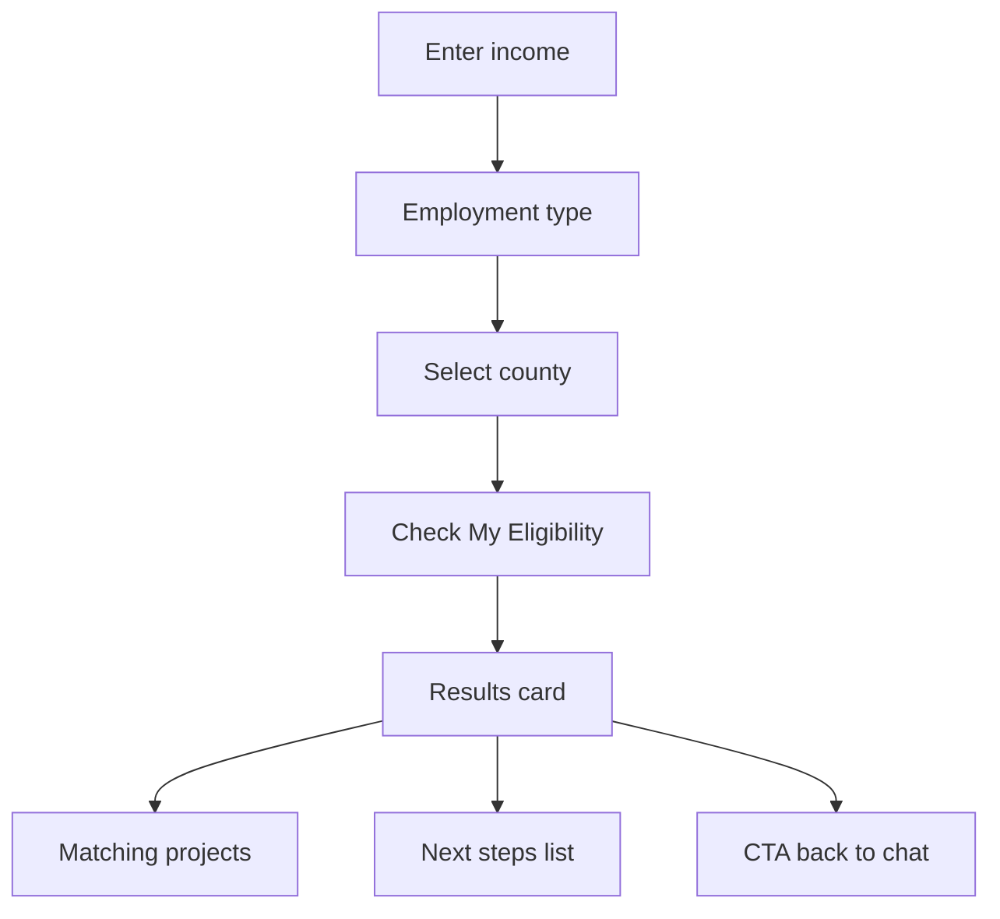

# Frontend

Boma Yangu AI has two static HTML applications with no bundler or framework. All logic is inline `<script>` blocks with shared design tokens (CSS variables).

---

## Shared design system

Both pages use:

| Token | Role |
|-------|------|
| `--purple`, `--lavender`, `--teal`, `--cream` | Brand palette |
| `--panel-bg` | Sidebar / header dark surfaces |
| `--chat-bg`, `--text`, `--muted` | Main content (light/dark) |
| `data-theme="light\|dark"` | Theme toggle |

**Fonts (Google Fonts):**

- **Syne** — headings, buttons
- **Plus Jakarta Sans** — body
- **DM Mono** — stats, timestamps

---

## `index.html` — Chat application

### Layout

```
┌─────────────────────────────────────────────┐
│  Sidebar (panel)  │  Chat area              │
│  - Brand          │  - Header (status)      │
│  - Stats          │  - Messages           │
│  - County filter  │  - Composer             │
│  - Quick topics   │                         │
│  - Lang / dark    │                         │
└─────────────────────────────────────────────┘
```

Mobile: sidebar slides in over overlay (`openPanel` / `closePanel`).

### Internationalisation

Content strings live in `const C = { en: {...}, sw: {...} }`:

- Welcome title/subtitle
- Nav labels, chips (rotating sets), landing cards
- Status messages, placeholders

`setLang('en' | 'sw')` updates DOM and re-renders dynamic components.

### Landing experience

Before first message, `#welcome` shows:

1. Hero copy (`#w-title`, `#w-sub`)
2. **Chips** — `renderChips()` cycles through 3 suggestion sets on each AI reply
3. **Cards** — `renderCards()` six topic cards

**Eligibility card (index 0):** navigates to `/eligibility` instead of prefilling chat:

```javascript
el.onclick = i === 0
  ? () => { window.location.href = '/eligibility'; }
  : () => handleChip(card.q);
```

Other cards call `handleChip(card.q)` → fill input → `sendMsg()`.

### County filter

`renderCounties()` builds pill buttons from `C[lang].counties`.  
`selectedCounty` is sent to `/api/chat` as `county` (or `null` for “All”).

Footer shows `📍 CountyName` badge when filtered.

### Chat flow

| Function | Role |
|----------|------|
| `sendMsg()` | Validate, debounce 4s, POST `/api/chat`, append bubbles |
| `addMsg(role, text)` | Create message DOM with avatar |
| `showTyping()` | Typing indicator during fetch |
| `renderMarkdown(raw)` | Lightweight MD → HTML (bold, lists, cite spans) |
| `clearChat()` | Reset history, restore welcome + chips + cards |
| `quickAsk(btn)` | Sidebar topic → send |

**History:** `history` array of `{ role, content }` (user + assistant). Max 12 sent to API.

### Stats animation

Sidebar counters animate from 0 to target (`data-count`) on load — decorative KB metrics (601 embeddings, 62 documents, etc.).

### API error UX

On failure, shows bilingual fallback strings; does not expose server error details to user.

---

## `eligibility.html` — Eligibility checker

**Route:** `/eligibility` (via `vercel.json` rewrite from clean URL)

### User flow



### Form fields

| Field | ID | Values |
|-------|-----|--------|
| Gross monthly income | `#income` | Number (KES) |
| Employment | `name="emp"` | `employed`, `self`, `informal` |
| County | `#county` | Nairobi + 7 counties + other |

### Core functions

| Function | Purpose |
|----------|---------|
| `getBand(income)` | Map income → `BANDS` entry |
| `getLevy(income, emp)` | 1.5% monthly levy |
| `getEligibility(income, emp)` | yes / maybe / no + reason |
| `matchProjects(bandId, county)` | Filter `NAIROBI_PROJECTS` |
| `getSteps(emp, band, county)` | Personalised HTML step list |
| `checkEligibility()` | Main orchestrator + DOM render |
| `resetForm()` | Show form again |

### Income bands (`BANDS`)

| ID | Label | Monthly range (KES) |
|----|-------|---------------------|
| `social` | Social Housing | 0 – 19,999 |
| `lowcost` | Low-Cost Affordable | 20,000 – 49,999 |
| `standard` | Affordable Standard | 50,000 – 149,999 |
| `market` | Market Rate | 150,000+ |

### Nairobi projects data

`NAIROBI_PROJECTS` is a large in-script array with:

- Project name, location, status, unit types
- Prices, sold-out flags, TPS monthly notes
- Inline `// Source:` comments for maintainers

**Other counties:** `OTHER_COUNTY_MSG` shows informational copy + portal link — no fabricated prices.

### Results UI

- Eligibility badge (yes / maybe / no)
- Band chip + description
- Summary table (income, levy, deposit 12.5%, etc.)
- Project cards with status pills (`active`, `construction`, `soldout`, …)
- Numbered steps (`<ul class="steps-list">`)
- “Ask AI →” links to `/`

### Scam banner

Persistent red-tinted banner: registration is free; official portal only.

---

## Routing (`vercel.json`)

```json
{
  "rewrites": [
    { "source": "/eligibility", "destination": "/eligibility.html" }
  ]
}
```

| URL | File |
|-----|------|
| `/` | `index.html` |
| `/eligibility` | `eligibility.html` |
| `/api/chat` | `api/chat.js` |

---

## Accessibility & UX notes

- Semantic headings on eligibility page
- `aria-label` on send and menu buttons
- `inputmode="numeric"` on income field
- Sticky header on eligibility page
- Smooth scroll to results after check

**Future improvements:** focus trap in mobile panel, `prefers-reduced-motion` for animations, shared JS module for theme toggle.

---

## Modifying the UI safely

| Change | Files |
|--------|-------|
| New chat topic card | `C.en.cards` / `C.sw.cards` in `index.html` |
| New chip suggestions | `C.*.chips` arrays |
| New county (chat) | `renderCounties` raw list + `C.*.counties` |
| New county (eligibility) | `<select id="county">` + `OTHER_COUNTY_MSG` |
| New Nairobi project | `NAIROBI_PROJECTS` in `eligibility.html` |
| Styles | `:root` variables in each file’s `<style>` |

Keep EN/SW pairs in sync when adding user-visible strings.
