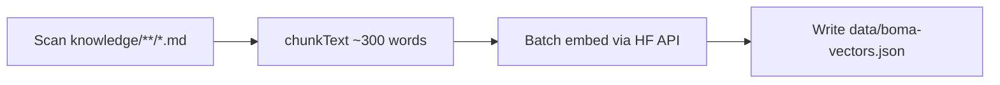

# Knowledge base

The knowledge base (KB) is the **source of truth** for factual answers. The AI does not browse the live web; it uses retrieved chunks from `knowledge/` embedded into `data/boma-vectors.json`.

---

## Statistics (current)

| Metric | Value |
|--------|-------|
| Markdown files | 63 |
| Vector chunks | 601 |
| Embedding dimensions | 384 |
| Embedding model | `sentence-transformers/all-MiniLM-L6-v2` |

---

## Folder structure

```
knowledge/
├── core/                    # Programme mechanics (numbered guides)
│   ├── 01-what-is-boma-yangu.md
│   ├── 02-eligibility.md
│   ├── 03-levy.md
│   ├── 5-lottery.md
│   ├── 06-after-winning.md … 17-legal-framework.md
│   ├── 15-faq-master.md
│   └── Support_Glossary/
│       ├── terms-glossary-en-sw.md
│       └── contacts-directory.md
│
├── Citizens/                # Audience-specific guides
│   ├── Employed.md
│   ├── Self-employed.md
│   ├── Diaspora.md
│   ├── informal-sector-mama-mboga.md
│   └── civil-servants-scheme.md
│
├── Regions/                 # County & regional housing context
│   ├── Nairobi.md, Mombasa.md, Kisumu.md, …
│   └── nyanza-region.md, rift-valley-region.md, …
│
├── Context/                 # Cultural & conversational grounding (01–20)
│   ├── 01-kenyan-language-guide.md
│   ├── 07-sheng-glossary.md
│   ├── 10-kenyan-tone-guide.md
│   ├── 12-corruption-navigation.md
│   └── 20-kenya-media-and-trust.md
│
├── security/
│   └── scams.md
│
└── Employers.md/
    └── employer-guide.md
```

### What belongs where

| Folder | Use for |
|--------|---------|
| `core/` | Laws, processes, FAQs, documents, payments, appeals — **canonical facts** |
| `Citizens/` | Variations by employment type or special schemes |
| `Regions/` | County projects, local pricing context, regional agencies |
| `Context/` | **How** to speak to Kenyans — not primary legal facts |
| `security/` | Fraud patterns, red flags, reporting |
| `Employers.md/` | Employer levy obligations |

---

## Authoring guidelines

### 1. Start with trust and safety

Many core files open with a **scam alert** block. Keep this pattern for anything involving money, agents, or registration.

### 2. Use structured sections

Prefer:

- `##` headings for scanability
- **Quick answers** at the top for common questions
- Bullet lists for requirements and steps
- Explicit **sources** and `last_verified` dates where facts change

Example front matter (from civil servants file):

```markdown
---
topic: Civil Servants & Public Sector Workers
last_verified: 2026-05-16
sources:
  - Affordable Housing Act, 2024
  - Boma Yangu official portal
confidence_score: High
---
```

### 3. Write for retrieval

- One idea per paragraph; avoid giant tables without headers.
- Repeat important synonyms (e.g. “housing levy”, “NHDF”, “1.5%”).
- Include both English and Swahili terms where users might search in either language.

### 4. Do not invent live data

If a price or deadline is uncertain, say so and point to the portal. The eligibility page and API prompts enforce the same rule.

### 5. Tone (see `Context/10-kenyan-tone-guide.md`)

- Warm, direct, non-bureaucratic
- Lead with the answer
- Acknowledge real frustrations without cynicism

---

## How content becomes vectors

### Pipeline (`script/buildVectors.js`)



1. **Discover** all `.md` files recursively under `knowledge/`.
2. **Chunk** each file: sliding window ~250–300 words, minimum chunk length 100 characters.
3. **Embed** in batches of 5 texts per Hugging Face request (500 ms pause between batches).
4. **Save** JSON array: `{ text, source, embedding }` where `source` is the relative path (e.g. `core\\02-eligibility.md`).

### Running the build

```bash
# Requires HF_TOKEN in .env.local
node script/buildVectors.js
```

Expected output: `Done. 601 vectors saved to data/boma-vectors.json`

### When to rebuild

Rebuild and commit `boma-vectors.json` after:

- Adding or removing KB files
- Large edits that change wording in existing files
- Fixing factual errors that must appear in RAG results

You do **not** need to rebuild for:

- Pure CSS/UI changes
- `eligibility.html` project table updates (separate from vectors)
- `api/chat.js` prompt-only changes

---

## Chunk object schema

### Stored on disk (today)

```json
{
  "text": "… chunk content …",
  "source": "core/02-eligibility.md",
  "embedding": [384 floats]
}
```

### Supported by retrieval (optional, not yet in build)

```json
{
  "scope": "national",
  "county": "Nairobi"
}
```

To enable county-aware retrieval, extend `buildVectors.js` to set `county` from `Regions/` filenames or YAML front matter.

---

## Relationship to the system prompt

`api/chat.js` includes **baseline programme knowledge** in `SYSTEM_PROMPT` (levy rate, income bands, application steps). The KB is **primary** for specifics; the prompt fills gaps only for general concepts.

If retrieval returns `NO_KB_MATCH`, the model must admit uncertainty and cite bomayangu.go.ke — not guess.

---

## Source URL mapping

Chunk filenames are mapped to official URLs in `api/chat.js` → `SOURCE_URLS`. When adding files, update that map so citations resolve correctly (e.g. levy → KRA, eligibility → bomayangu.go.ke/eligibility).

---

## Quality checklist for new KB articles

- [ ] Scam warning if money/registration involved
- [ ] `last_verified` date set
- [ ] Official links included
- [ ] EN + SW key terms where helpful
- [ ] Vector rebuild run and spot-checked in chat
- [ ] `SOURCE_URLS` updated if new filename pattern
